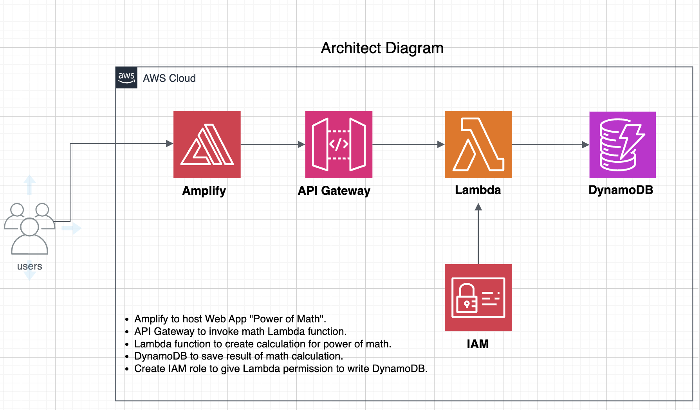

# AWS Web Application Project

## Project Overview
This project demonstrates an end-to-end web application built using five different AWS services: Amplify, Lambda, IAM, API Gateway, and DynamoDB. The application performs basic math operations and stores the results in DynamoDB.

## Services Used
1. **AWS Amplify**: Hosts the frontend (HTML page).
2. **AWS Lambda**: Executes backend logic to perform math operations.
3. **AWS IAM**: Provides the necessary permissions for Lambda to interact with DynamoDB.
4. **API Gateway**: Acts as a RESTful interface to invoke Lambda functions.
5. **DynamoDB**: Stores the results of the math operations.

## Project Setup and Workflow

### 1. Host Webpage on AWS Amplify
- Create an `index.html` file for the web application’s frontend.
- Use AWS Amplify to host the webpage.
- Ensure that the Amplify service successfully deploys the page and check the URL to confirm the webpage is live and functional.

### 2. Create Lambda Function for Math Operations
- Create an AWS Lambda function to perform basic math (e.g., addition, subtraction, multiplication).
- Test the Lambda function by creating a test event in the Lambda console to ensure the math logic is correctly implemented.

### 3. Use API Gateway to Invoke Lambda
- Set up a REST API in AWS API Gateway to trigger the Lambda function.
- Use the **POST** method and enable **CORS** to allow the frontend to make requests to the API.
- Test the API Gateway by invoking the Lambda function through it.

### 4. Store Math Results in DynamoDB
- Create a DynamoDB table with a partition key (e.g., `ID`) to store the math results.
- Design the table to store operation results with a unique identifier.

### 5. Grant Lambda Permission to Access DynamoDB
- Assign a JSON policy to the Lambda function’s execution role to allow it to write results to DynamoDB.
- The policy will look something like this:
  ```json
  {
    "Version": "2012-10-17",
    "Statement": [
      {
        "Effect": "Allow",
        "Action": "dynamodb:PutItem",
        "Resource": "arn:aws:dynamodb:REGION:ACCOUNT_ID:table/TableName"
      }
    ]
  }
  ```
- Attach this policy to the Lambda execution role in AWS IAM.

### 6. Update Lambda Function to Save Results in DynamoDB
- Modify the Lambda function code to save the results of the math operation in DynamoDB.
- Re-test the function and verify that the results are stored correctly in the DynamoDB table.

### 7. Update Frontend (index.html)
- Edit the `index.html` file to include CSS styles for improved user interface.
- Add an input field where users can type the numbers for the math operation.
- Implement a script to invoke the API Gateway from the frontend, making a request to the Lambda function to perform the operation and return the result.

## Running the Project

1. **Deploy the Webpage**:
   - Use AWS Amplify to host your `index.html` page and get the live URL.
2. **Test the Lambda Function**:
   - Test the Lambda function locally using the Lambda console or AWS CLI.
3. **Test the API Gateway**:
   - Use a REST client (e.g., Postman) to invoke the API Gateway and ensure it triggers the Lambda function correctly.
4. **Check DynamoDB Results**:
   - Verify that the math results are saved in DynamoDB.

## Conclusion
This project showcases how to integrate AWS services like Amplify, Lambda, API Gateway, IAM, and DynamoDB to build a functional web application from scratch. The application performs basic math operations, stores the results in a NoSQL database, and presents an interactive UI hosted on AWS.

